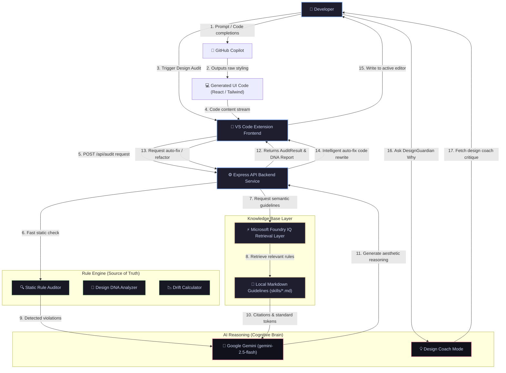

# DesignGuardian AI

### *Eliminate Generic AI UI Before It Ships.*

[](https://github.com/microsoft)
[](https://azure.microsoft.com)
[](https://visualstudio.microsoft.com)

---

## 📖 Executive Summary & Problem Statement

Modern AI coding assistants have dramatically accelerated software construction. Developers can generate entire React, Next.js, and Tailwind CSS components with a single prompt. However, this velocity introduces a major problem: **the homogeny of generic AI-generated interfaces**.

AI models frequently generate components that suffer from:
*   **Excessive Styling Noise**: Overused gradients, oversized drop shadows, and gaudy glassmorphism.
*   **Design System Drift**: Arbitrary padding, non-standard border radiuses, and hardcoded colors.
*   **Accessibility Failures**: Missing image alt descriptions and icon buttons devoid of ARIA tags.
*   **Visual Inconsistency**: Weak typography hierarchy and lack of vertical alignment.

### Why Existing AI UI Generation Fails
Traditional linters (e.g., ESLint, Stylelint) only check code syntax and basic styles. They have no concept of aesthetic guidelines, visual balance, or brand identity. As a result, developers unknowingly ship unpolished, template-looking SaaS interfaces that erode brand trust and user conversion.

### The Solution: DesignGuardian AI
**DesignGuardian AI** is a real-time Design Governance Platform built as a VS Code Extension. It acts as an intelligent design reviewer, scanning front-end code directly inside the editor. By coupling a fast local rule engine with the retrieval powers of **Microsoft Foundry IQ** and Gemini's cognitive design reasoning, DesignGuardian AI detects style violations, provides citation-backed explanations, and automatically refactors generic code into world-class, brand-compliant UI.

---

## 🏗️ Architecture & Flow Diagram

DesignGuardian AI leverages a decoupled, provider-based monorepo architecture. Below is the enterprise-grade workflow showing how developer code is analyzed, validated against Microsoft Foundry IQ, and refactored.



---

## ⚡ Core Features

### 1. Real-Time Component Audit
Instantly inspect React, HTML, JSX, and TSX code blocks. DesignGuardian AI audits components across six categories: **Spacing**, **Typography**, **Colors**, **Borders**, **Shadows**, and **Accessibility**.

### 2. Intelligent Auto-Fix Refactoring
Instead of static search-and-replace rules, DesignGuardian AI generates a complete, context-aware code refactor. In a single click, it cleans unapproved classes while preserving state handlers, functional props, and DOM hierarchies.

### 3. Design Compliance Score
Computes a weighted compliance score from `0-100` dynamically. Severe violations (such as raw color hexes or missing accessibility tags) reduce the score significantly, making visual design quality immediately measurable.

### 4. Design DNA Profiling
Parses the component's style sheet and generates a **Design DNA Report**. It extracts style classification types (*Developer Tool*, *Consumer Tech*, etc.), visual characteristics (*Minimal*, *Technical*, *Monochromatic*), and explains the strategy narrative.

### 5. Design Drift Detection
Computes the percentage of style divergence by highlighting unapproved margins, non-modular paddings, unregistered font families, and arbitrary shadows that are not present in your token system.

### 6. Citation-Backed Design Reviews
Every audit violation includes a precise citation back to the approved design system rules. It shows the file source (e.g. `spacing.md`), the rule ID, and a dedicated **Why This Matters** section.

### 7. Design Coach Mentorship
Provides a **`🧠 Ask DesignGuardian Why`** console. Rather than just returning list items, Gemini acts as a design coach, offering actionable suggestions on visual balance, readability pacing, and contrast layouts.

---

## ⚡ Microsoft Foundry IQ Integration

DesignGuardian AI integrates **Microsoft Foundry IQ** as its enterprise knowledge layer, serving as the system's absolute source of truth.

```
skills/
├── spacing.md           # SPACE-001 to SPACE-030 (Grid system rules)
├── typography.md        # TYPO-001 to TYPO-030 (Font scale constraints)
├── color-system.md      # COLOR-001 to COLOR-030 (Approved palette variables)
├── accessibility.md     # ACC-001 to ACC-030 (WCAG 2.1 accessibility guides)
├── premium-branding.md  # BRAND-001 to BRAND-030 & border/shadow curves
└── design-dna.md        # DNA-001 to DNA-030 (Visual profile guidelines)
```

### How Microsoft Foundry IQ Works in DesignGuardian:
1.  **Semantic Retrieval**: When a developer requests an audit, the server queries the Microsoft Foundry IQ retrieval API using the component context.
2.  **Constraint Validation**: Foundry IQ searches the Markdown knowledge bases to find rules relevant to the style classes in use (e.g., checking padding tags against the modular scale in `spacing.md`).
3.  **Strict Citations**: Foundry IQ retrieves the exact rule block, returning citations (e.g., `spacing.md: Rule SPACE-001 - Modular Spacing Scale`).
4.  **Mitigating Hallucinations**: By feeding this retrieved context directly into our AI reasoning layer (Gemini), we guarantee that all generated recommendations and refactoring outputs align with our design guidelines.

---

## 👩‍💻 How GitHub Copilot Accelerated Development

GitHub Copilot was utilized as our primary pair programmer throughout the development lifecycle, accelerating velocity and enabling a single developer to build a complete monorepo in record time.

### Realistic Examples of Copilot Acceleration:

*   **Scaffolding & Boilerplate Generation**:
    *   *Prompt*: `Create a VS Code extension webview panel setup in TypeScript that loads an HTML file and sets up a message listener for audit, fix, and DNA commands.`
    *   *Result*: Copilot instantly scaffolded `DesignGuardianPanel.ts` including disposing mechanisms, resource roots configurations, and extension message dispatchers.
*   **TypeScript Monorepo Compilation Configurations**:
    *   *Prompt*: `Configure a root package.json using npm workspaces containing shared, server, and extension packages, ensuring builds compile in order.`
    *   *Result*: Copilot generated the monorepo root config and TS config references, eliminating manual workspace setup overhead.
*   **Custom Local Rule Engine (Regex Matching)**:
    *   *Prompt*: `Write a TS function in audit.service.ts that scans strings for hex colors, checks if they are in an allowed array, and reports line numbers.`
    *   *Result*: Copilot implemented the regex scanner in `runLocalStaticAudit` that serves as our lightning-fast, offline violation detector.
*   **Complex UI State Management in Webview**:
    *   *Prompt*: `Write a line-by-line code diff comparison renderer in vanilla JavaScript for a webview panel.`
    *   *Result*: Copilot generated the diff matching algorithms inside the webview scripts, displaying elegant visual additions/deletions.

---

## 🛠️ Technology Stack

*   **Extension Frontend**:
    *   VS Code Extension API
    *   TypeScript
    *   Tailwind CSS (in Webview dashboard UI)
*   **Backend Services**:
    *   Node.js (v18+)
    *   Express
    *   TypeScript
*   **Design Intelligence Layer**:
    *   Google Gemini API (utilizing `gemini-2.5-flash` model for reasoning)
    *   Local Static Audit Rule Engine
*   **Knowledge Base Layer**:
    *   Microsoft Foundry IQ integration
    *   Markdown Design Guidelines

---

## 📂 Project Directory Structure

```
c:\Users\acer\OneDrive\Desktop\Microsoft Hackathon/
├── shared/
│   └── src/types.ts
├── skills/
│   ├── spacing.md
│   ├── typography.md
│   ├── color-system.md
│   ├── accessibility.md
│   ├── premium-branding.md
│   └── design-dna.md
├── server/
│   ├── src/services/
│   │   ├── ai.service.ts
│   │   ├── audit.service.ts
│   │   ├── dna.service.ts
│   │   ├── drift.service.ts
│   │   ├── refactor.service.ts
│   │   └── providers/
│   ├── src/app.ts
│   └── src/index.ts
├── extension/
│   ├── src/extension.ts
│   ├── src/apiClient.ts
│   └── src/DesignGuardianPanel.ts
└── demo/
    ├── Button.tsx
    └── Card.tsx
```

---

## 🚀 Installation & Quick Start

### Prerequisites
*   Node.js (v18+)
*   npm (v9+)
*   VS Code

### 1. Build and Setup Workspace
Clone the project repository and run the following in the root folder to install dependencies and compile TypeScript packages across all workspaces:

```bash
npm install
npm run build
```

### 2. Configure Environment Variables
Create a `.env` file in the `server/` subdirectory:

```env
PORT=3000

# Gemini API Key (Required for AI features)
GEMINI_API_KEY=your_gemini_api_key

# Microsoft Foundry IQ Credentials
FOUNDRY_ENDPOINT=https://your-foundry-endpoint.microsoft.com
FOUNDRY_PROJECT_ID=your-project-id
FOUNDRY_AGENT_ID=your-agent-id
FOUNDRY_API_KEY=your-api-key
```

*Note: If Foundry credentials are omitted, the backend server automatically defaults to the offline **LocalKnowledgeProvider** to ensure a fully functional demo flow.*

### 3. Start the Backend API Server
Run the backend Express service:

```bash
npm run start:server
```
The server will boot on `http://localhost:3000`. You can check server health at `http://localhost:3000/api/health`.

### 4. Launch the Extension
1.  Open the workspace folder in VS Code.
2.  Press **`F5`** (or select **Run and Debug** in the left sidebar and click **Launch Extension**).
3.  A new **[Extension Development Host]** VS Code window will open.

---

## 🎮 Live Demo Walkthrough

Inside the **[Extension Development Host]** window:

1.  **Open target code**: Open the file `demo/Button.tsx` (the React component containing violations).
2.  **Audit the component**: Open the Command Palette (`Ctrl+Shift+P` on Windows or `Cmd+Shift+P` on macOS) and run:
    ```
    DesignGuardian: Audit Component
    ```
3.  **Inspect dashboard**: The dashboard launches in a tab, displaying:
    *   A circular **Design Score** of `68/100`.
    *   **Compliance Boost Card** showing `68/100 -> 98/100 (+30 Boost)`.
    *   **Review Timeline Stepper** rendering every violation (unapproved gradients, `rounded-3xl` corner shapes, custom `shadow-2xl` depth) as a step-by-step visual chain.
4.  **Check Design DNA**: Select the **Design DNA Report** tab. Review the classification (*Developer Tool*), visual characteristics, and visual strategy narrative generated by Gemini.
5.  **Refactor component**: Switch to the **Code Fix Diff** tab to review the side-by-side colorized diff showing the suggested code fixes.
6.  **Apply auto-fix**: Click **Apply to Editor** at the top right of the dashboard. The code in `demo/Button.tsx` instantly updates to comply with the design guidelines, and the Design Score updates to **100/100**.
7.  **Consult Design Coach**: Go to the **Design Coach** tab, and click **Ask DesignGuardian Why**. Review the design review feedback explaining visual hierarchy.

---

## 🏆 Judging Criteria Alignment

DesignGuardian AI has been engineered to align with the core judging criteria of the hackathon:

*   **Microsoft Technology Depth (Foundry IQ)**: Uses Microsoft Foundry IQ as its enterprise-grade semantic search layer, converting flat markdown rules into a secure, hallucination-free knowledge base.
*   **GitHub Copilot Integration**: Utilized Copilot throughout our development cycle to write regex rule matchers, script layout-level HTML/CSS panels, configure workspaces, and debug asynchronous messages.
*   **Creative Execution & Innovation**: Solves a major developer productivity bottleneck by shifting design system validation left—catching visual mistakes inside the IDE before they reach production.
*   **Technical Rigor**: Built as a robust TypeScript monorepo utilizing workspace packages, native VS Code APIs, provider design patterns, and Express REST APIs.
*   **Real-world Impact**: Designed for teams shipping enterprise SaaS (Stripe, Linear caliber). It maintains visual trust, reduces design review time, and guarantees accessibility compliance.

---

## 🔒 Security & Compliance

*   **Data Minimization**: The extension only transmits the selected code block to the local backend server, protecting workspace intellectual property.
*   **Exclusion Lists**: The `.env` file is excluded from Git version control via the root `.gitignore` file, protecting private API credentials.
*   **Zero Hardcoding**: All API credentials and endpoints are resolved dynamically at runtime using server environment variables.
*   **Boundary Sanitation**: Code replacements are validated for syntax and safety before writing back to active editors.
